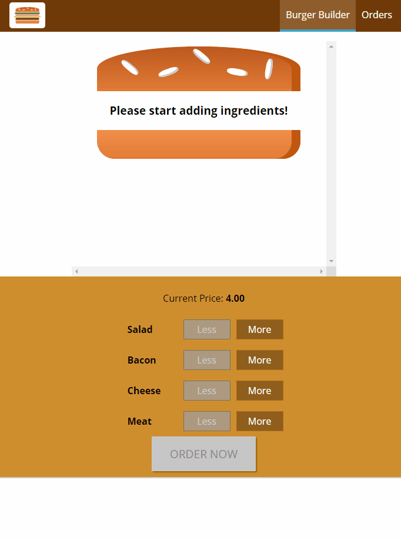

# Burger Builder App 🍔
A single-page React App that allows a user to build a virtual burger, and pretend to purchase it



### To Install
```
git clone https://github.com/Ben-893/Burger-Builder-React && cd Burger-Builder-React
npm install
```

### To Use
```
- npm start
```

### Technologies used
- React
- Redux
- JavaScript 
- HTML
- CSS
- Google Firebase (backend)

#### More improvments to follow... 🍔
